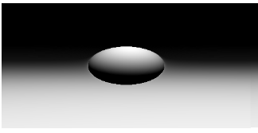

# Ray Marching Renderer (p5.js)

This project is a **minimal ray marching renderer** implemented from scratch in **JavaScript (p5.js)**.

The renderer uses **signed distance functions (SDFs)** and the **sphere tracing algorithm** to render 3D geometry without relying on shaders or GPU acceleration.

### Features
- Manual ray generation from a virtual camera
- Sphere tracing with configurable step limits
- Signed distance function for implicit geometry
- Normal estimation via finite differences
- Basic diffuse (Lambertian) lighting
- Pixel-by-pixel rendering using the CPU

This project was created as an experiment to understand the fundamentals behind ray tracing and ray marching techniques, focusing on clarity and mathematical correctness rather than performance.

### Preview

  

